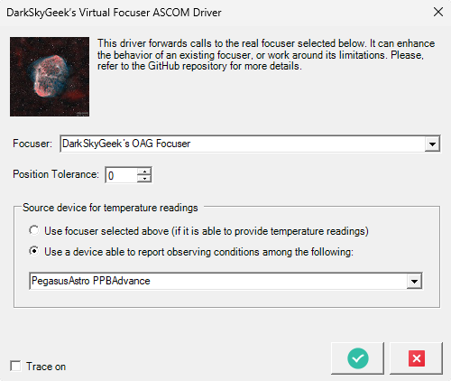
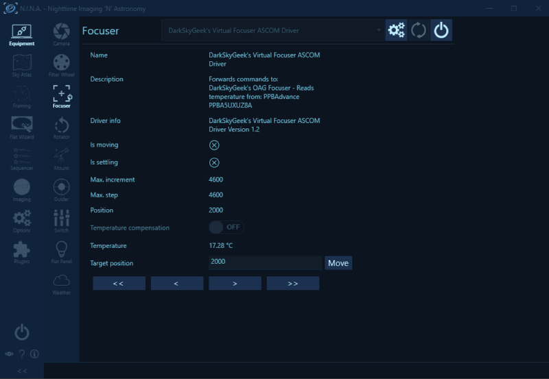

# Virtual Focuser ASCOM Driver

I do not charge anything to create and maintain these open-source projects. But if you would like to say "thanks" for this project, feel free to send any amount through Paypal using the button below. I appreciate your support!

* [Introduction](#introduction)
  + [Stable Temperature Reading](#stable-temperature-reading)
  + [Focuser Skipping Steps](#focuser-skipping-steps)
  + [Read Temperature From Another Device](#read-temperature-from-another-device)
* [Screenshots](#screenshots)
* [Downloading And Installing The Driver](#downloading-and-installing-the-driver)
* [Compiling The Driver (For Developers Only)](#compiling-the-driver-for-developers-only)
* [Frequently Asked Questions (FAQ)](#frequently-asked-questions-faq)
* [Credits](#credits)

## Introduction

This ASCOM driver allows us to work around certain limitations or bugs of electronic focusers and their driver/firmware without increasing the complexity of the image acquisition application.

### Stable Temperature Reading

This driver averages temperature readings over a 120 second rolling window and excludes outliar values. Indeed, the temperature reported by some focusers, like ZWO’s EAF, can be "jumpy". Additionally, I have seen focusers occasionally report incorrect values, such as a temperature of a million degrees, before getting back to normal. In order to implement temperature compensation, it is essential to have an accurate and stable temperature reading, which is what this virtual driver accomplishes.

### Focuser Skipping Steps

Certain older focusers, such as the Hedrick focuser designed by PlaneWave, occasionally skip one or two steps. This issue becomes apparent when using the original Celestron handset, which PlaneWave recommended for that focuser some years ago. Regrettably, the sole remedy suggested by PlaneWave was to invest in a costly upgrade of the focuser's electronics and software, a solution that seemed excessive to address a relatively minor flaw in an otherwise perfectly functional focuser.

During the autofocus (AF) process executed by N.I.N.A. or SGP, the focuser is asked to reach a specific position. Subsequently, the software polls the driver until that position has been reached. However, due to intermittent step skipping, the focuser occasionally does not quite reach its intended position. For instance, if the AF routine had instructed the focuser to move to position 4,560, it might have stopped at 4,559 steps, and this eventually leads to an AF failure.

The solution involves establishing a "position tolerance". Whenever the AF routine directs the focuser to move to a specific position, we not only relay it to the original driver, but we also record that target position. Once the focuser has stopped moving, and if its position is close enough to the target position, within the defined tolerance, we return the target position the focuser should technically be at.

By default, the tolerance is set to 0, but it can be increased in the focuser settings dialog.

### Read Temperature From Another Device

Let’s say that you have a ZWO EAF electronic focuser, but you did not buy the optional temperature probe that ZWO sells separately. As a result, the temperature readings you get from the focuser are completely wrong. Or maybe your temperature probe is not working correctly or reliably. Maybe it was not properly calibrated, which is something I have noticed on some units. Or maybe you have an older focuser, or one that does not provide temperature readings, like the [Dark Sky Geek electronic focuser](https://github.com/jlecomte/ascom-oag-focuser), which was originally designed to control an OAG, so there would have been little value for me to add a temperature sensor to it. If you are in this situation, you will not be able to implement focus temperature compensation in N.I.N.A., because <ins>N.I.N.A. only uses the temperature values reported by the focuser</ins>.

So, what to do in this case? Well, if you look at the [ASCOM Platform API](https://ascom-standards.org/Help/Developer/html/G_ASCOM.htm), you’ll see that there are at least two types of devices that are able to report temperature values: focusers, which implement the `IFocuserV3` interface, but also a category of devices that report what the ASCOM standard calls "observing conditions", and those devices implement the `IObservingConditions` interface. An ASCOM-compatible weather station would most likely be in that second category, and is essentially used in observatories as a safety monitor.

Not that many people own an ASCOM-compatible weather station. However, a lot of astrophotographers own one of the Pegasus Astro PowerBox models (or similar units from other brands), because they are extremely useful. Indeed, they combine a USB hub, power distribution, and a dew heater controller. Those devices come with a temperature and humidity sensor, so that they can modulate how much power should be sent to the dew heater bands throughout the night. Well, guess what? Their ASCOM driver also implements the `IObservingConditions` interface, so they are able to report temperature values. And it turns out that the temperature values reported by my Pocket PowerBox Advance are much more stable and accurate than those provided by my QHY Q-Focuser or my ZWO EAF when used with their respective temperature probes. Wouldn’t it be nice to have N.I.N.A. use that device to get temperature readings instead of that reported by the focuser? Well, yes, it would be! However, the N.I.N.A. developers have rejected that idea, and understandably so! Indeed, they want to constrain the complexity of their application, so that it remains maintainable over a long period of time, which is a concern that most software engineers are acutely aware of. So, instead of modifying N.I.N.A., which would only benefit N.I.N.A. users, I decided to update this virtual focuser driver to allow you to select the device you want to use as the source for the temperature readings. The acquisition software, whichever you use, will think that the temperature readings come from the focuser, and voila!

Note that the temperature readings from that separate device will also be averaged out over a 120 second rolling window, and outliar values will be excluded, as explained above.

## Screenshots

Here is the driver settings dialog, where you can select the focuser you want to control, and set other options depending on your exact situation:

And here is a screenshot of N.I.N.A. with the virtual focuser connected:

## Downloading And Installing The Driver

Starting with version `1.0.1`, you can install the ASCOM driver by running the executable setup file that you will find in the [releases page](https://github.com/jlecomte/ascom-virtual-focuser/releases). By default, it places files under `C:\Program Files (x86)\Dark Sky Geek\Virtual Focuser ASCOM Driver`.

## Compiling The Driver (For Developers Only)

Open Microsoft Visual Studio as an administrator (right-click on the Microsoft Visual Studio shortcut, and select "Run as administrator"). This is required because when building the code, by default, Microsoft Visual Studio will register the compiled COM components, and this operation requires special privileges (Note: This is something you can disable in the project settings...) Then, open the solution (`ASCOM_Driver\ASCOM.DarkSkyGeek.VirtualFocuser.sln`), change the solution configuration to `Release` (in the toolbar), open the `Build` menu, and click on `Build Solution`. As long as you have properly installed all the required dependencies, the build should succeed and the ASCOM driver will be registered on your system. The binary file generated will be `ASCOM_Driver\bin\Release\ASCOM.DarkSkyGeek.VirtualFocuser.dll`.

## Frequently Asked Questions (FAQ)

**Question:** My antivirus identifies your setup executable file as a malware (some kind of Trojan)

**Answer:** This is a false detection, extremely common with installers created with [Inno Setup](https://jrsoftware.org/isinfo.php) because virus and malware authors also use Inno Setup to distribute their malicious payload... Anyway, there isn't much I can do about this, short of signing the executable. Unfortunately, that would require a code signing certificate, which costs money. So, even though the executable I uploaded to GitHub is perfectly safe, use at your own risk!

## Credits

The position tolerance feature was generously contributed by [Rafa Barberá](https://github.com/rbarbera).
