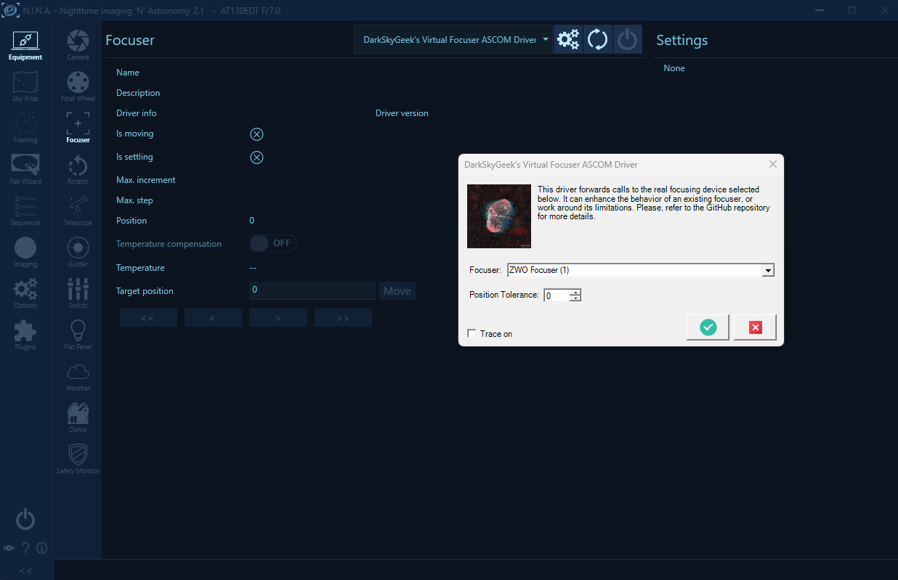

# Virtual Focuser ASCOM Driver

I do not charge anything to create and maintain these open-source projects. But if you would like to say "thanks" for this project, feel free to send any amount through Paypal using the button below. I appreciate your support!

* [Introduction](#introduction)
  + [Stable Temperature Reading](#stable-temperature-reading)
  + [Focuser Skipping Steps](#focuser-skipping-steps)
* [Screenshots](#screenshots)
* [Downloading And Installing The Driver](#downloading-and-installing-the-driver)
* [Compiling The Driver (For Developers Only)](#compiling-the-driver-for-developers-only)
* [Frequently Asked Questions (FAQ)](#frequently-asked-questions-faq)

## Introduction

This ASCOM driver allows us to work around certain limitations or bugs of electronic focusers and their driver/firmware without increasing the complexity of the image acquisition application.

### Stable Temperature Reading

This driver averages temperature readings over a 120 second rolling window. Indeed, the temperature reported by some focusers, like ZWO’s EAF, can be "jumpy". In order to implement temperature compensation, it is essential to have an accurate and stable temperature reading, which is what this virtual driver accomplishes.

### Focuser Skipping Steps

Certain older focusers, such as the Hedrick focuser designed by PlaneWave, occasionally skip one or two steps. This issue becomes apparent when using the original Celestron handset, which PlaneWave recommended for that focuser some years ago. Regrettably, the sole remedy suggested by PlaneWave was to invest in a costly upgrade of the focuser's electronics and software, a solution that seemed excessive to address a relatively minor flaw in an otherwise perfectly functional focuser.

During the autofocus (AF) process executed by N.I.N.A. or SGP, the focuser is asked to reach a specific position. Subsequently, the software polls the driver until that position has been reached. However, due to intermittent step skipping, the focuser occasionally does not quite reach its intended position. For instance, if the AF routine had instructed the focuser to move to position 4,560, it might have stopped at 4,559 steps, and this eventually leads to an AF failure.

The solution involves establishing a "position tolerance". Whenever the AF routine directs the focuser to move to a specific position, we not only relay it to the original driver, but we also record that target position. Once the focuser has stopped moving, and if its position is close enough to the target position, within the defined tolerance, we return the target position the focuser should technically be at.

By default, the tolerance is set to 0, but it can be increased in the focuser settings dialog.

## Screenshots

To select the focuser device driver to connect to, open the settings dialog:

## Downloading And Installing The Driver

Starting with version `1.0.1`, you can install the ASCOM driver by running the executable setup file that you will find in the [releases page](https://github.com/jlecomte/ascom-virtual-focuser/releases). By default, it places files under `C:\Program Files (x86)\Dark Sky Geek\Virtual Focuser ASCOM Driver`.

## Compiling The Driver (For Developers Only)

Open Microsoft Visual Studio as an administrator (right-click on the Microsoft Visual Studio shortcut, and select "Run as administrator"). This is required because when building the code, by default, Microsoft Visual Studio will register the compiled COM components, and this operation requires special privileges (Note: This is something you can disable in the project settings...) Then, open the solution (`ASCOM_Driver\ASCOM.DarkSkyGeek.VirtualFocuser.sln`), change the solution configuration to `Release` (in the toolbar), open the `Build` menu, and click on `Build Solution`. As long as you have properly installed all the required dependencies, the build should succeed and the ASCOM driver will be registered on your system. The binary file generated will be `ASCOM_Driver\bin\Release\ASCOM.DarkSkyGeek.VirtualFocuser.dll`.

## Frequently Asked Questions (FAQ)

**Question:** My antivirus identifies your setup executable file as a malware (some kind of Trojan)

**Answer:** This is a false detection, extremely common with installers created with [Inno Setup](https://jrsoftware.org/isinfo.php) because virus and malware authors also use Inno Setup to distribute their malicious payload... Anyway, there isn't much I can do about this, short of signing the executable. Unfortunately, that would require a code signing certificate, which costs money. So, even though the executable I uploaded to GitHub is perfectly safe, use at your own risk!
