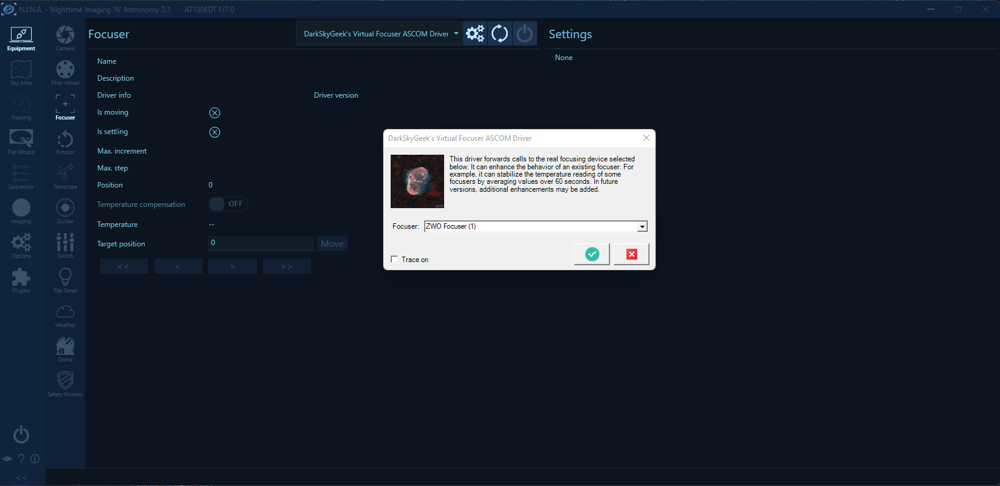

# Virtual Focuser ASCOM Driver

This ASCOM driver provides additional functionality on top of the specified focuser device driver it connects to. At the time of this writing, the only functionality that has been implemented so far is that it averages temperature readings over 120 seconds. Indeed, the temperature reported by some focusers, like ZWO’s EAF, can be "jumpy". In order to implement temperature compensation, it is essential to have an accurate and stable temperature reading, which is what this virtual driver accomplishes. In the future, additional functionality may be implemented as needed by the author.

To select the focuser device driver to connect to, open the settings dialog:

