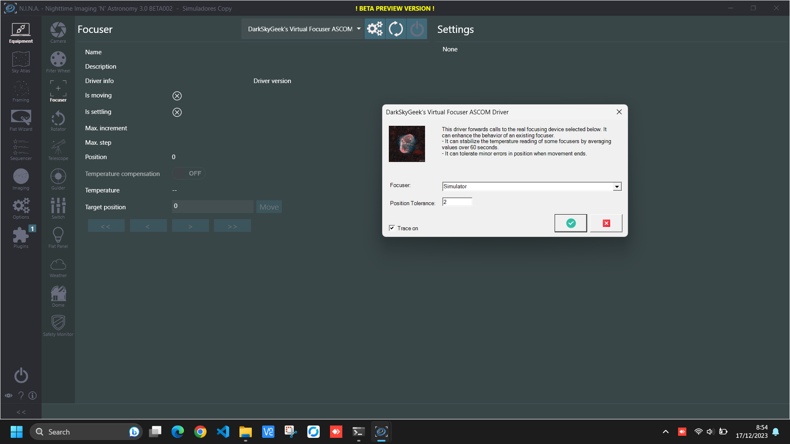

# Virtual Focuser ASCOM Driver

- [Introduction](#introduction)
- [Screenshots](#screenshots)
- [Downloading And Installing The Driver](#downloading-and-installing-the-driver)
- [Compiling The Driver (For Developers Only)](#compiling-the-driver-for-developers-only)

## Introduction

This ASCOM driver provides additional functionality on top of the specified focuser device driver it connects to. At the time of this writing, the only functionality that has been implemented so far is that it averages temperature readings over 120 seconds. Indeed, the temperature reported by some focusers, like ZWO’s EAF, can be "jumpy". In order to implement temperature compensation, it is essential to have an accurate and stable temperature reading, which is what this virtual driver accomplishes. In the future, additional functionality may be implemented as needed by the author.

Another example is position tolerance. Some old focusers miss one or two steps when moving. Usually, this difference is not visible in the image, but the focusing algorithm will never finish or may fail due to a timeout. In this example, we have added a focuser tolerance, and it will report the goal focus position when asked if the real driver position is within this tolerance.

## Screenshots

To select the focuser device driver to connect to, open the settings dialog:



## Downloading And Installing The Driver

**Step 1:** Download the driver from the [releases page](https://github.com/jlecomte/ascom-virtual-focuser/releases), and place the file `ASCOM.DarkSkyGeek.VirtualFocuser.dll` somewhere on your system (example: `C:\Users\julien\ascom-virtual-focuser\`).

**Step 2:** Open a command prompt, but make sure you run it **as an administrator**!

**Step 3:** Then, proceed with the installation of the driver using `RegAsm.exe`, a utility that should already be present on your system (it comes with the .NET framework). Just don't forget to use the 64 bit version, and to pass the `/tlb /codebase` flags. Here is what it looked like on my imaging mini computer:

```
> cd C:\Users\julien\ascom-virtual-focuser\
> C:\Windows\Microsoft.NET\Framework64\v4.0.30319\RegAsm.exe /tlb /codebase ASCOM.DarkSkyGeek.VirtualFocuser.dll
Microsoft .NET Framework Assembly Registration Utility version 4.8.4161.0
for Microsoft .NET Framework version 4.8.4161.0
Copyright (C) Microsoft Corporation.  All rights reserved.

Types registered successfully
```

**Note:** The output may be more verbose than the above. As long as it says `Types registered successfully`, you are good to go!

**Note:** Once the driver has been installed, make sure you do _not_ delete or move the `ASCOM.DarkSkyGeek.VirtualFocuser.dll` file, or things will not work! (if you do move it, you will need to register it again in its new location)

**Step 4:** Start (or restart, if it was already running) N.I.N.A. (or whatever application you use to control your equipment).

## Compiling The Driver (For Developers Only)

Open Microsoft Visual Studio as an administrator (right-click on the Microsoft Visual Studio shortcut, and select "Run as administrator"). This is required because when building the code, by default, Microsoft Visual Studio will register the compiled COM components, and this operation requires special privileges (Note: This is something you can disable in the project settings...) Then, open the solution (`ASCOM.DarkSkyGeek.VirtualFocuser.sln`), change the solution configuration to `Release` (in the toolbar), open the `Build` menu, and click on `Build Solution`. As long as you have properly installed all the required dependencies, the build should succeed and the ASCOM driver will be registered on your system. The binary file generated will be `bin\Release\ASCOM.DarkSkyGeek.VirtualFocuser.dll`. You may also download this file from the [Releases page](https://github.com/jlecomte/ascom-virtual-focuser/releases).
